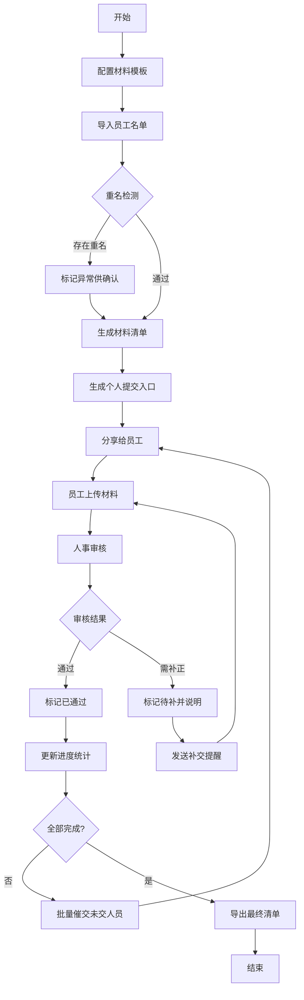

## 1. 产品概述
入职材料整理与追踪工具，帮助中小企业人事部门批量管理新员工入职材料，自动识别缺失项并智能催交，减少人工核对与反复沟通。
- 核心目标：解决入职材料收集效率低、遗漏多、催交繁琐的痛点
- 目标用户：中小企业HR、行政人事人员
- 市场价值：将入职材料整理效率提升80%以上，消除人工遗漏风险

## 2. 核心功能

### 2.1 用户角色
| 角色 | 注册方式 | 核心权限 |
|------|---------|---------|
| 人事管理员 | 本地使用无需注册 | 全部功能：导入名单、管理模板、审核材料、发送提醒、导出数据 |
| 新员工 | 通过分享链接访问 | 仅可访问个人提交入口，查看待交材料并上传 |

### 2.2 功能模块
1. **名单导入模块**：员工信息批量导入、Excel/CSV支持、单条手动添加、重名校验、数据预览
2. **材料校验模块**：材料类型模板管理、缺失文件自动识别、证件到期智能提示、材料审核标记
3. **提醒发送模块**：批量催交通知、个人提交入口生成、提醒记录追踪、自定义催交文案
4. **进度面板模块**：分类展示（未交/待补/已通过）、完成率统计图表、补交记录、异常备注、清单导出

### 2.3 页面详情
| 页面名称 | 模块名称 | 功能描述 |
|---------|---------|---------|
| 仪表盘首页 | 统计概览 | 总人数、完成率、未交/待补/已通过数量卡片、趋势图 |
| 仪表盘首页 | 快捷操作 | 快速导入名单、新增员工、发送催交提醒入口 |
| 员工管理 | 员工列表 | 表格展示所有员工，支持搜索筛选、状态标签、批量操作 |
| 员工管理 | 名单导入 | Excel/CSV文件上传、字段映射、数据预览、重名检测 |
| 员工管理 | 员工详情 | 个人信息、材料清单、提交状态、审核记录、补交历史 |
| 材料模板 | 模板列表 | 材料类型定义、是否必填、有效期设置、适用岗位 |
| 材料模板 | 模板编辑 | 新增/编辑材料类型，设置提醒天数 |
| 提醒中心 | 催交面板 | 按状态分类展示，一键批量催交、单独发送 |
| 提醒中心 | 提交入口 | 生成个人专属链接/二维码，复制分享 |
| 数据导出 | 导出清单 | 选择字段、筛选条件，导出Excel报表 |

## 3. 核心流程
人事管理员登录系统 → 配置入职材料模板 → 导入待入职员工名单 → 系统自动匹配每位员工所需材料 → 生成个人提交入口并分享给员工 → 员工提交材料后人事审核 → 系统实时更新进度统计 → 对未交/待补人员批量发送催交 → 全部完成后导出汇总清单。

## 4. 用户界面设计
### 4.1 设计风格
- 主色：采用稳重专业的深蓝 (#1e3a5f) 作为主色调，搭配青绿色 (#10b981) 表示通过状态，琥珀色 (#f59e0b) 表示待补状态，红色 (#ef4444) 表示未交状态
- 按钮风格：圆角6px，悬停有微提升阴影，点击有按压反馈
- 字体：中文使用"思源黑体"，英文使用"JetBrains Mono"等宽字体展示数据
- 布局风格：左侧导航栏 + 顶部操作栏 + 主内容区的经典后台布局，卡片式信息展示
- 图标风格：使用Lucide线性图标，保持统一线宽

### 4.2 页面设计概述
| 页面名称 | 模块名称 | UI元素 |
|---------|---------|--------|
| 仪表盘 | 统计卡片 | 渐变背景、大号数字、趋势箭头、状态颜色标识 |
| 仪表盘 | 进度概览 | 环形进度图、分类进度条、动态数字滚动 |
| 员工列表 | 数据表格 | 斑马纹行、状态色标签、悬停高亮、复选框批量选择 |
| 员工详情 | 材料清单 | 材料卡片组、上传时间线、审核状态徽章 |
| 提醒中心 | 催交面板 | 三栏布局（未交/待补/已通过）、拖拽卡片、一键催交按钮 |
| 提交入口 | 分享弹窗 | 二维码展示、链接复制按钮、一键分享提示 |

### 4.3 响应式
桌面端优先设计（最小支持1280px宽度），平板端自动折叠侧边栏为图标模式，移动端（<768px）采用底部Tab导航替代侧边栏，表格改为卡片列表展示。
