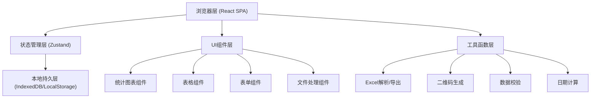
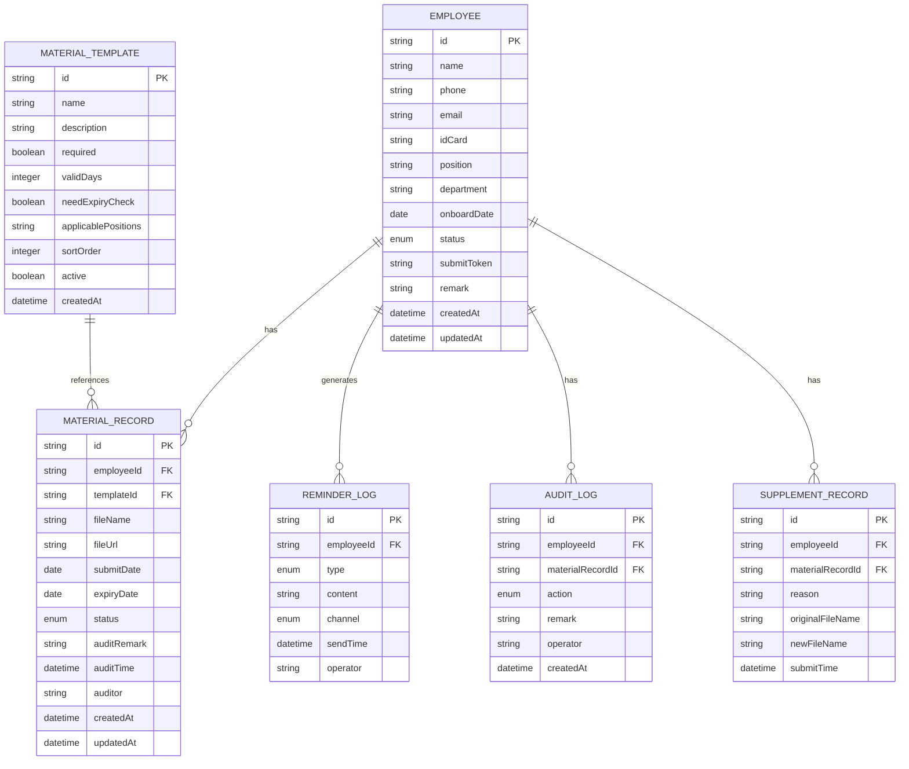

## 1. 架构设计

## 2. 技术描述
- 前端框架：React@18 + TypeScript@5
- 构建工具：Vite@5
- 样式方案：TailwindCSS@3
- 状态管理：Zustand@4
- 路由管理：React Router DOM@6
- UI图标：Lucide React
- Excel处理：xlsx (SheetJS)
- 二维码：qrcode.react
- 图表：Recharts
- 数据库：浏览器本地存储（IndexedDB通过zustand-persist中间件）
- 后端：无（纯前端SPA，数据全部本地存储，支持导出备份）

## 3. 路由定义
| 路由 | 页面 | 用途 |
|------|------|------|
| / | Dashboard | 仪表盘首页，统计概览与快捷操作 |
| /employees | EmployeeList | 员工列表，展示与管理所有待入职人员 |
| /employees/:id | EmployeeDetail | 员工详情，个人材料清单与审核 |
| /employees/import | EmployeeImport | 名单导入页面，Excel上传与字段映射 |
| /templates | MaterialTemplates | 材料模板管理页面 |
| /reminders | ReminderCenter | 提醒中心，催交与提交入口管理 |
| /submit/:token | EmployeeSubmit | 员工个人提交入口（外部访问页） |
| /export | DataExport | 数据导出页面 |
| /settings | Settings | 系统设置页面 |

## 4. 数据模型

### 4.1 数据模型定义（ER图）

### 4.2 数据枚举值
- EmployeeStatus: `pending`(待提交) | `submitted`(已提交待审核) | `supplement`(待补交) | `approved`(已通过)
- MaterialStatus: `missing`(未交) | `pending_audit`(待审核) | `rejected`(需补正) | `approved`(已通过) | `expiring`(即将到期) | `expired`(已过期)
- ReminderType: `first`(首次提醒) | `urge`(催交提醒) | `supplement`(补交提醒) | `expiry`(到期提醒)
- ReminderChannel: `email`(邮件) | `sms`(短信) | `link`(链接分享) | `copy`(复制文案)
